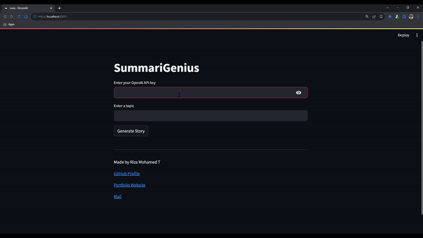

# SummariGenius

>SummariGenius is a content summarization tool built with Streamlit in Python, leveraging the OpenAI GPT-3 API for generating concise summaries of given topics or content.


<a href="https://summarigenius.streamlit.app/">
</br>
  
</a>
>To get an API key for using the OpenAI API, you can [sign up here](https://platform.openai.com/api-keys).



## Table of Contents

- [Introduction](#introduction)
- [Features](#features)
- [Installation](#installation)
- [Usage](#usage)
- [API Reference](#api-reference)
- [Contributing](#contributing)
- [License](#license)
- [Acknowledgements](#acknowledgements)
- [Contact](#contact)

## Introduction

>SummariGenius is a Streamlit-powered application designed to summarize content using OpenAI's powerful GPT-3 language model. It provides users with an intuitive interface to input topics or content they want summarized, utilizing the OpenAI API's language processing capabilities.

## Features

- Input field for OpenAI API key.
- Text area to enter content or topics for summarization.
- Generate summarized content with a click of a button.

## Installation

- To run SummariGenius locally, follow these steps:

1. Clone the repository:

    ```bash
    git clone https://github.com/codewithriza/SummariGenius/
 
    ```
1. Go to the file:

    ```bash
    cd SummariGenius
    ```
2. Install dependencies:

    ```bash
    pip install -r requirements.txt
    ```
3. Run the application:

    ```bash
    streamlit run app.py
    ```

## Usage

After following the installation steps, open your browser and navigate to `localhost:8501` to access the SummarizeX application. Enter your OpenAI API key and the content or topic you want summarized. Click the "Generate Summary" button to get the summarized content.

## API Reference

This project utilizes the OpenAI GPT-3 API for text summarization. For more information on the OpenAI API and its usage, refer to the [OpenAI API documentation](https://beta.openai.com/docs/).

To get an API key for using the OpenAI API, you can [sign up here](https://platform.openai.com/api-keys).

## Contributing

Contributions are welcome! Feel free to submit issues or pull requests.

## License

This project is licensed under the [MIT License](LICENSE).

## Acknowledgements

- [Streamlit](https://streamlit.io/)
- [OpenAI](https://openai.com/)

## Contact

For questions, feedback, or support, please contact:

- Riza Mohamed T
- Email: codewithriza@gmail.com
- Website: [Click here](https://rizamohamed.netlify.app/)
- SummariGenius live demo : [Click here ](https://summarigenius.streamlit.app/)
